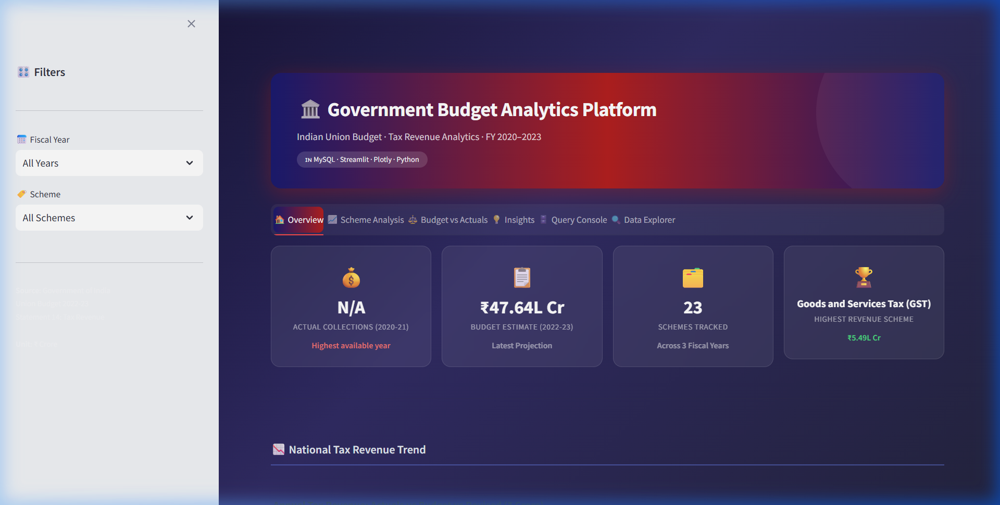
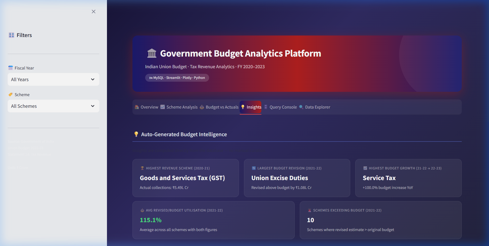
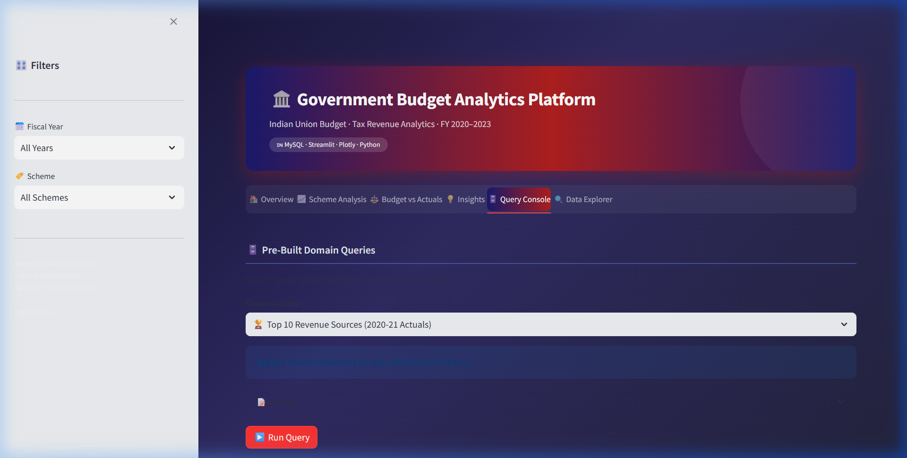
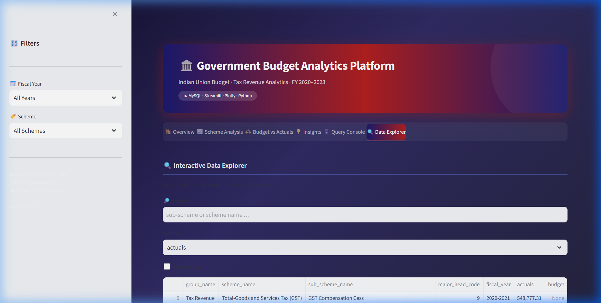
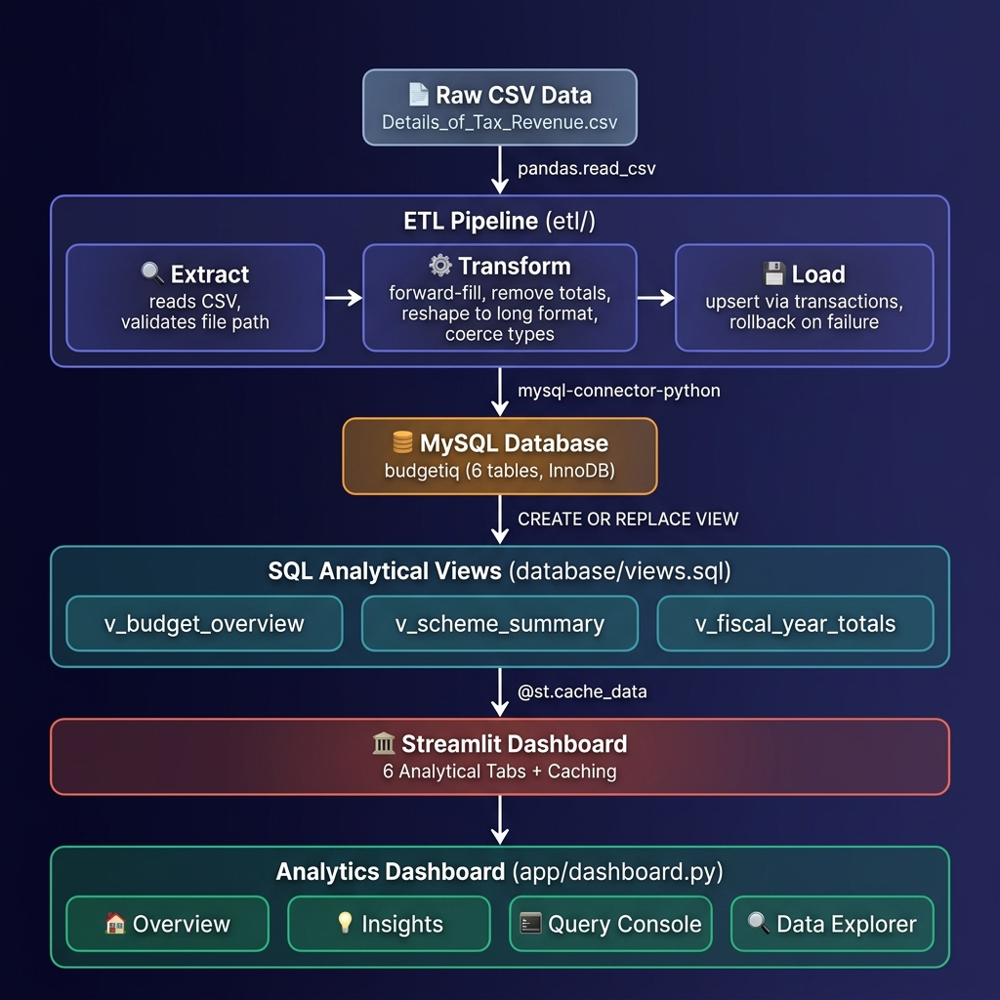
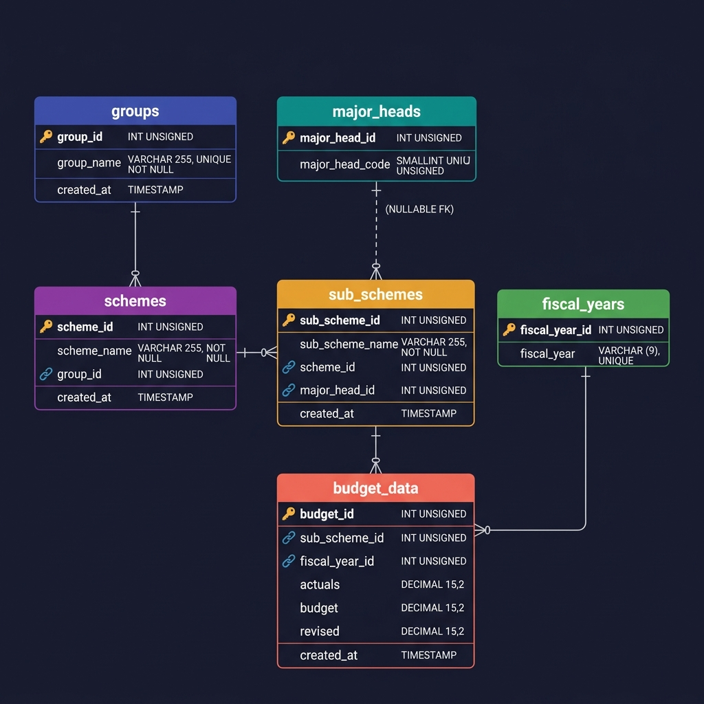

# 🏛️ Government Budget Analytics Platform

[](https://python.org)
[](https://mysql.com)
[](https://streamlit.io)
[](https://plotly.com)
[](tests/)
[](LICENSE)

> A production-grade analytics platform for exploring Indian Union Budget tax revenue data
> across fiscal years 2020–2021 to 2022–2023. Built with a fully normalised MySQL schema,
> a modular ETL pipeline with 23 automated tests, and an interactive 6-tab Streamlit dashboard.

---

## 📸 Screenshots

> *Run `python manage.py dashboard` to see the live dashboard.*


| Overview Tab | Insights Tab |
|---|---|
|  |  |
| *(KPI cards + revenue trend + donut chart)* | *(Auto-generated budget intelligence)* |

| Query Console | Data Explorer |
|---|---|
|  |  |
| *(5 pre-built SQL domain queries)* | *(Searchable table + CSV/Excel export)* |

---

## 🏗️ Architecture



| Layer | Technology | Purpose |
|---|---|---|
| Data Source | CSV | Government of India Statement 14 |
| Extract | `pandas.read_csv` | Validates file, returns DataFrame |
| Transform | pandas | Forward-fill, remove summaries, reshape |
| Load | `mysql-connector-python` | Upsert with transaction + rollback |
| Database | MySQL 8 / InnoDB | 6-table normalised schema |
| Views | SQL `CREATE VIEW` | Analytical abstraction layer |
| Dashboard | Streamlit + Plotly | 6-tab interactive analytics |

---

## 🗄️ Database Schema (ER Diagram)



```
groups (1) ──── (∞) schemes (1) ──── (∞) sub_schemes ──── (∞) budget_data
                                         sub_schemes (∞) ──── (1) major_heads
                                         budget_data (∞) ──── (1) fiscal_years
```

| Table | Rows | Key Constraints |
|---|---|---|
| `groups` | 1 | `UNIQUE(group_name)` |
| `schemes` | 23 | `UNIQUE(scheme_name, group_id)` |
| `major_heads` | 7 | `UNIQUE(major_head_code)` |
| `sub_schemes` | 68 | `UNIQUE(sub_scheme_name, scheme_id)` |
| `fiscal_years` | 3 | `UNIQUE(fiscal_year)`, FORMAT CHECK |
| `budget_data` | 201 | `UNIQUE(sub_scheme_id, fiscal_year_id)` |

All tables: `ENGINE=InnoDB DEFAULT CHARSET=utf8mb4`. Every FK column has an explicit index.

---

## ✨ Features

### 📊 Analytics Dashboard (6 Tabs)

| Tab | What It Shows |
|---|---|
| 🏠 Overview | KPI cards, national revenue trend line, scheme composition donut |
| 📈 Scheme Analysis | Top-N bar chart with slider, year-over-year grouped comparison |
| ⚖️ Budget vs Actuals | Scatter plot with 100% utilisation line, utilisation % bar |
| 💡 Insights | **Auto-generated** — top scheme, highest growth, largest revision, avg utilisation |
| 🗄️ Query Console | 5 pre-built domain SQL queries with SQL viewer + CSV/Excel export |
| 🔍 Data Explorer | Searchable, sortable table with CSV + Excel download |

### 🏗️ Engineering Features

- **Modular ETL** — Extract / Transform / Load in separate modules, wired by an orchestrator
- **Idempotent pipeline** — `INSERT IGNORE` + `ON DUPLICATE KEY UPDATE`; safe to re-run
- **Transaction safety** — single commit; rollback on any failure
- **23 automated tests** — covering all ETL logic, no database required
- **Config validation** — clear error messages before any DB operation
- **File logging** — every run appended to `logs/application.log`
- **manage.py CLI** — `setup`, `load`, `validate`, `dashboard`, `test`
- **Excel export** — download any query result or explorer view as `.xlsx`

---

## 📁 Project Structure

```
DBMS_project/
│
├── app/
│   └── dashboard.py          # 6-tab Streamlit analytics dashboard
│
├── config/
│   ├── settings.py            # Environment-based configuration (reads .env)
│   └── validator.py           # Config validation guard (nice errors, not crashes)
│
├── database/
│   ├── schema.sql             # 6-table normalised schema, constraints, indexes
│   ├── views.sql              # 3 analytical SQL views
│   └── setup.py              # Idempotent DB initialiser
│
├── etl/
│   ├── extract.py             # Extract: read + validate raw CSV
│   ├── transform.py           # Transform: clean, forward-fill, reshape
│   ├── load.py                # Load: upsert with transaction + rollback
│   └── pipeline.py           # Orchestrator: Extract → Transform → Load
│
├── tests/
│   ├── conftest.py            # Shared pytest fixtures (no DB required)
│   └── test_transform.py      # 23 tests: extract, transform, fiscal-year mapping
│
├── utils/
│   ├── db.py                  # MySQL connection factory
│   └── logger.py             # Logs to stdout + logs/application.log
│
├── data/
│   └── Details_of_Tax_Revenue.csv   # Raw source (Government of India)
│
├── assets/screenshots/
│   ├── architecture.png       # System architecture diagram
│   └── er_diagram.png        # Entity-Relationship diagram
│
├── logs/                      # Auto-created — application.log written here
│
├── .env.example               # Template — copy to .env and fill credentials
├── .gitignore
├── manage.py                  # CLI: setup / load / validate / dashboard / test
├── requirements.txt
├── setup_db.py               # Standalone: python setup_db.py
└── run_etl.py                # Standalone: python run_etl.py
```

---

## ⚡ Quick Start

### Prerequisites

| Tool | Version | Notes |
|---|---|---|
| Python | 3.11+ | |
| MySQL Server | 8.0+ | Must be running locally |

### 4-Command Setup

```bash
# 1. Clone
git clone https://github.com/Nishant8677/Government-Budget-Analytics-Platform.git
cd Government-Budget-Analytics-Platform

# 2. Install dependencies
pip install -r requirements.txt

# 3. Configure
cp .env.example .env          # Then open .env and fill in DB_PASSWORD
python manage.py validate     # Confirms your config before touching the DB

# 4. Setup → Load → Dashboard
python manage.py setup        # Creates budgetiq DB + schema + views
python manage.py load         # ETL: CSV → MySQL (201 records)
python manage.py dashboard    # Launches http://localhost:8501
```

> ⚠️ Never commit `.env` — it is already excluded by `.gitignore`.

---

## 🖥️ manage.py Commands

```bash
python manage.py setup      # Step 1: create database + apply schema + views
python manage.py load       # Step 2: run ETL pipeline (Extract→Transform→Load)
python manage.py validate   # Check .env configuration without touching the DB
python manage.py dashboard  # Launch Streamlit dashboard
python manage.py test       # Run pytest test suite
python manage.py test -v    # Verbose test output
```

---

## 🧪 Running Tests

```bash
python manage.py test
```

Expected output:
```
============================= test session starts =============================
collected 23 items

tests/test_transform.py::TestExtract::test_raises_file_not_found_on_missing_csv PASSED
tests/test_transform.py::TestExtract::test_returns_dataframe_for_valid_csv PASSED
tests/test_transform.py::TestTransformRowFiltering::test_removes_total_rows PASSED
...
tests/test_transform.py::TestGetFiscalYearRecords::test_fiscal_year_values_are_valid_strings PASSED

============================== 23 passed in 0.23s ==============================
```

Tests are grouped into 6 classes:
- `TestExtract` — file validation
- `TestTransformRowFiltering` — summary row removal
- `TestTransformForwardFill` — sparse CSV fills
- `TestTransformNumericCoercion` — type coercion
- `TestTransformValidation` — missing column errors
- `TestFiscalYearColumnMap` — **bug-fix regression tests** (the critical ones)
- `TestGetFiscalYearRecords` — record expansion and structure

---

## 🔒 Security Notes

| Practice | Implementation |
|---|---|
| No hardcoded credentials | All credentials from `.env` via `python-dotenv` |
| No SQL injection | All queries use `%s` parameterised placeholders |
| Secret exclusion | `.gitignore` covers `.env`, `logs/`, `__pycache__` |
| Config validation | `validate()` exits cleanly with actionable errors |

---

## 📐 ETL Design Decisions

### Why separate Extract / Transform / Load modules?
Each phase has a single responsibility and can be tested in isolation. `extract()` accepts an optional `filepath` argument so tests pass a mock CSV without touching the filesystem. `load()` takes a plain list of dicts, making it database-agnostic for testing.

### Why upsert instead of delete-and-reload?
`INSERT IGNORE` on reference tables and `ON DUPLICATE KEY UPDATE` on `budget_data` means the pipeline is re-runnable without wiping data — critical when adding new fiscal years.

### Why a single transaction?
All records commit together. Individual bad rows are skipped with a warning. A systemic failure triggers `ROLLBACK`, leaving the database in a clean state for retry.

### What bug was fixed?
The original `pythoncode.py` used string-matching on column names to determine which fiscal year to populate, causing `Revised 2021-2022` values to be incorrectly written to 2022-2023 rows. The fix documents the exact column mapping explicitly in `FISCAL_YEAR_COLUMN_MAP` — protected by dedicated regression tests.

---

## 🛠️ Tech Stack

| Technology | Version | Use |
|---|---|---|
| Python | 3.11 | Core language |
| MySQL | 8.0 | Relational database |
| mysql-connector-python | 9.x | DB driver |
| pandas | 2.x | ETL data manipulation |
| python-dotenv | 1.x | Environment config |
| Streamlit | 1.35+ | Dashboard framework |
| Plotly | 5.x / 6.x | Interactive charts |
| openpyxl | 3.x | Excel export |
| pytest | 9.x | Test framework |

---

## 🔧 Troubleshooting

| Problem | Solution |
|---|---|
| `Access denied for user 'root'` | Check `DB_PASSWORD` in `.env` |
| `Unknown database 'budgetiq'` | Run `python manage.py setup` first |
| `No module named 'config'` | Run commands from the project root directory |
| `FileNotFoundError: Details_of_Tax_Revenue.csv` | Ensure file is in `data/` |
| Dashboard shows "Database not connected" | Confirm `.env` credentials and MySQL is running |
| `python manage.py validate` fails | Shows exactly which env variable is missing |

---

## 🔮 Future Work

- [ ] GitHub Actions CI — run `pytest` on every push
- [ ] Support additional fiscal years (extend `FISCAL_YEAR_COLUMN_MAP`)
- [ ] State-level budget breakdown (add `states` table to schema)
- [ ] Streamlit authentication for multi-user deployment
- [ ] PDF export using `reportlab`
- [ ] Performance benchmark tab (cache vs no-cache timing)

---

## 📄 License

MIT License — see [LICENSE](LICENSE) for details.

---

## 👤 Author

Computer Science student | Building production-grade software engineering portfolio projects.

**Skills demonstrated in this project:**
Database normalisation · ETL pipeline engineering · SQL view architecture ·
Parameterised queries · Environment-based configuration · pytest testing ·
Interactive data visualisation · Transaction management · CLI tooling
